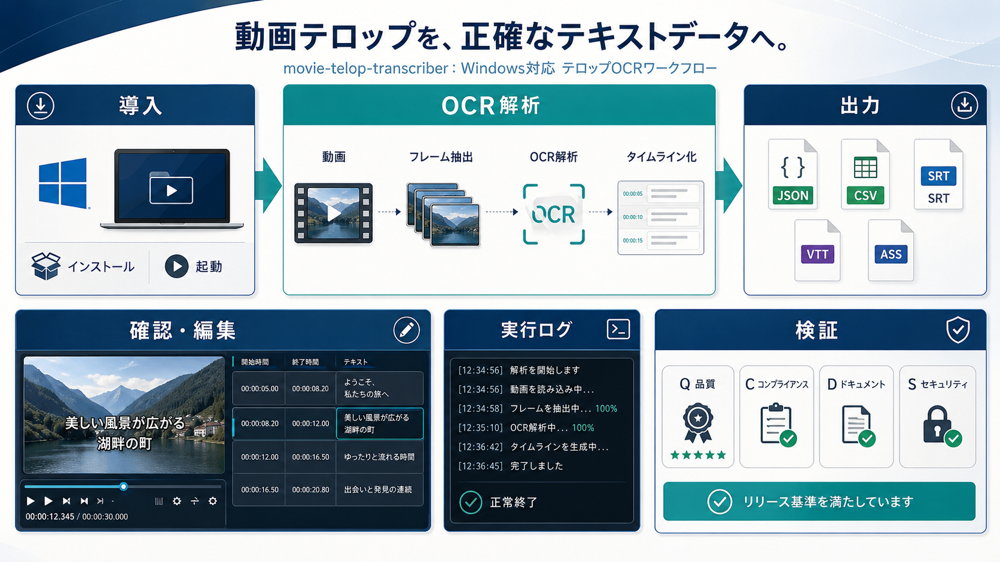

# movie-telop-transcriber

`movie-telop-transcriber` は、動画内のテロップを OCR で読み取り、文字列、表示時刻、表示位置、暫定的な見た目属性を構造化データとして出力する Windows 向け GUI アプリケーションです。

目的は、動画編集や字幕確認で必要になる「どの時刻に、どのテロップが、どの位置に出ていたか」を後から追跡できる形で残すことです。初期リリースでは WinUI 3 の画面から動画を選択し、フレーム抽出、PaddleOCR による認識、タイムライン確認、SRT / VTT / ASS / CSV / JSON 出力までを扱います。



## 利用者向け

### 最初に読む文書
- 文書全体の入口: [docs/00_文書ガイド.md](docs/00_文書ガイド.md)
- 再開時の状態確認: [docs/17_現在状態サマリ.md](docs/17_現在状態サマリ.md)
- 導入したい: [docs/12_導入手順書.md](docs/12_導入手順書.md)
- 使い方を知りたい: [docs/16_利用ガイド.md](docs/16_利用ガイド.md)
- 既知制約を先に確認したい: [docs/08_既知不具合と制約一覧.md](docs/08_既知不具合と制約一覧.md)

### できること
- 動画ファイルを選択し、一定間隔でフレームを抽出する。
- PaddleOCR PP-OCRv5 で日本語テロップを認識する。
- 認識結果をタイムライン、プレビュー、bounding box で確認する。
- タイムライン上のテキストをコピー、編集、削除する。
- `.mtproj` プロジェクトファイルとして、抽出済みフレーム、OCR 結果、タイムライン状態を保存し、あとから再表示できる。
- `segments.json`、`segments.csv`、`frames.csv`、`segments.srt`、`segments.vtt`、`segments.ass` を出力する。
- 処理ログと中間成果物を run 単位で保存し、後から確認できるようにする。

機能説明と使い方の具体例は [docs/16_利用ガイド.md](docs/16_利用ガイド.md) を参照してください。

### 動作環境
- Windows x64
- .NET 10 Desktop Runtime x64
- 実動画 OCR 用の Python 3.10-3.13 (64-bit) 環境
- PaddlePaddle `3.2.2` CPU
- PaddleOCR `3.5.0`
- OCR モデル: `PP-OCRv5_server_det`、`PP-OCRv5_server_rec`

### 導入方法
最短手順は次の 3 ステップです。

1. 配布 zip を展開する。
2. インストールしたい親ディレクトリで `Install-MovieTelopTranscriber.cmd` をダブルクリックする。
3. 作成された `MovieTelopTranscriber\app\MovieTelopTranscriber.App.exe` をダブルクリックして起動する。

`Install-MovieTelopTranscriber.cmd` は内部で PowerShell インストーラを呼び出し、実行したディレクトリ配下に `MovieTelopTranscriber` フォルダを作成します。その中へアプリ本体、PaddleOCR 用 Python 仮想環境、Python package、OCR モデル、起動設定ファイルをまとめて配置します。
導入後は同じフォルダに `Test-MovieTelopTranscriberOcrReadiness.ps1` も配置され、installer 自身も最後に OCR readiness を確認します。
配布 zip を開いたら、最初に `START_HERE.md` を見る前提にしています。

標準配布方式は `Release build を含む zip + installer` です。`dotnet publish --self-contained true` の出力は 2026-04-30 の再検証でも `0xC000027B` で終了したため、配布経路には使っていません。


配布 zip を展開した直下にも `app` フォルダは含まれますが、こちらは導入用同梱物です。通常起動は必ず `MovieTelopTranscriber\app\MovieTelopTranscriber.App.exe` またはスタートメニューの `Movie Telop Transcriber` を使います。
また、インストーラを実行したディレクトリには、導入後のアプリ本体を指す `Movie Telop Transcriber.lnk` も作成します。


PowerShell から直接実行する場合は、配布物を展開したフォルダで次を使います。

```powershell
powershell -NoProfile -ExecutionPolicy Bypass `
  -File .\Install-MovieTelopTranscriber.ps1
```

既定の配置先は次のとおりです。

| 種別 | 既定パス |
| --- | --- |
| アプリ本体 | `<実行ディレクトリ>\MovieTelopTranscriber` |
| OCR runtime | `<実行ディレクトリ>\MovieTelopTranscriber\ocr-runtime` |
| 起動設定ファイル | `<実行ディレクトリ>\MovieTelopTranscriber\app\movie-telop-transcriber.settings.json` |
| OCR readiness 診断 | `<実行ディレクトリ>\MovieTelopTranscriber\Test-MovieTelopTranscriberOcrReadiness.ps1` |
| 起動スクリプト | `<実行ディレクトリ>\MovieTelopTranscriber\Start-MovieTelopTranscriber.ps1` |
| OCR モデル | `%USERPROFILE%\.paddlex\official_models` |

同じ場所へ再インストールする場合は `-Force` を付けます。

```powershell
powershell -NoProfile -ExecutionPolicy Bypass `
  -File .\Install-MovieTelopTranscriber.ps1 `
  -Force
```

配布物の場所とは別のディレクトリへ入れたい場合は `-InstallRoot` と `-OcrRuntimeRoot` を指定します。

```powershell
powershell -NoProfile -ExecutionPolicy Bypass `
  -File .\Install-MovieTelopTranscriber.ps1 `
  -InstallRoot D:\Tools\movie-telop-transcriber `
  -OcrRuntimeRoot D:\Tools\movie-telop-ocr-runtime
```

配布 zip ではなくリポジトリ内の開発用スクリプトを直接使う場合は `tools/install/Install-MovieTelopTranscriber.ps1` を実行します。手動導入やオフライン導入が必要な場合は、[docs/12_導入手順書.md](docs/12_導入手順書.md) を参照してください。
画面イメージも [docs/12_導入手順書.md](docs/12_導入手順書.md) に掲載しています。
利用者向けのユースケースと画面説明は [docs/16_利用ガイド.md](docs/16_利用ガイド.md) に整理しています。
配布方式と導入構成の再評価結果は [docs/test-results/2026-04-30_配布方式と導入構成の再評価.md](docs/test-results/2026-04-30_配布方式と導入構成の再評価.md) に記録しています。

導入後に OCR runtime の成立を手動で再確認したい場合は、次を実行します。

```powershell
powershell -NoProfile -ExecutionPolicy Bypass `
  -File .\MovieTelopTranscriber\Test-MovieTelopTranscriberOcrReadiness.ps1 `
  -InstallRoot .\MovieTelopTranscriber
```

期待値は `status=ready` です。

### 起動方法
インストーラを使った場合は、スタートメニューの `Movie Telop Transcriber` または `<実行ディレクトリ>\MovieTelopTranscriber\app\MovieTelopTranscriber.App.exe` をダブルクリックして起動できます。

アプリは起動時に `movie-telop-transcriber.settings.json` を読み込み、PaddleOCR 用 Python、worker script、OCR 設定を解決します。PowerShell 起動スクリプトは互換用として残りますが、通常利用では不要です。

起動直後の画面:


設定画面:


### アンインストール
導入先の `MovieTelopTranscriber` フォルダにある `Uninstall-MovieTelopTranscriber.cmd` を実行すると、アプリ本体、OCR runtime、起動設定、スタートメニューショートカット、インストーラ実行ディレクトリに作成した `Movie Telop Transcriber.lnk`、導入先を指すユーザー環境変数を削除します。

PaddleOCR モデルキャッシュは、この導入で新規取得したものだけを削除します。共有キャッシュ全体を削除したい場合は、PowerShell から `Uninstall-MovieTelopTranscriber.ps1 -RemoveSharedModelCache` を実行します。

### 基本的な使い方
1. アプリを起動する。
2. 入力動画を選択する。
3. 出力先フォルダを指定する。
4. 必要に応じて設定画面で抽出間隔や OCR 検出設定を調整する。
5. `抽出` を実行する。
6. タイムラインとプレビューで結果を確認する。
7. 必要に応じてテキストを編集し、`出力のみ` で出力ファイルへ反映する。

出力先には `work/runs/<run_id>/` 相当の構成で、抽出フレーム、OCR 結果、属性推定結果、最終出力、ログが保存されます。

### トラブルシューティング
| 症状 | 確認すること | 対処 |
| --- | --- | --- |
| インストーラが PowerShell 実行ポリシーで止まる | 起動コマンドに `-ExecutionPolicy Bypass` があるか | README の導入コマンドをそのまま実行する |
| アプリが起動しない | .NET 10 Desktop Runtime x64 が入っているか | `dotnet --list-runtimes` で `Microsoft.WindowsDesktop.App 10.0.x` を確認し、不足していれば導入する |
| 起動直後に終了し、配布物外の publish 出力を使っている | `dotnet publish --self-contained true` の出力を直接起動していないか | GitHub Release のアプリ本体 zip または `Install-MovieTelopTranscriber` で導入した `MovieTelopTranscriber\app\MovieTelopTranscriber.App.exe` を使う |
| self-contained 再検証で `0xE0434352` になる | `WindowsAppSdkDeploymentManagerInitialize=true` を付けた self-contained publish を試していないか | unpackaged 実行では `プロセスにパッケージ ID がありません` で失敗するため、この回避策は使わない。標準配布構成へ戻す |
| インストーラが Python を見つけられない | `py -3.13`、`py -3.12`、`py -3.11`、`py -3.10` または `python --version` が使えるか | Python 3.10-3.13 (64-bit) を導入する。`py` ランチャーが無い PC では `-PythonCommand python` または `-PythonCommand "<Python インストール先>\\python.exe"` を付けて再実行する |
| OCR readiness が `warning` または `error` になる | `Test-MovieTelopTranscriberOcrReadiness.ps1` の `checks` に何が出ているか | `python_path`、`python_imports`、`paddle_models` の失敗項目を見て再導入またはモデル再取得を行う |
| OCR が `paddleocr` を import できない | `app\movie-telop-transcriber.settings.json` の `paddleOcr.pythonPath` が仮想環境を指しているか | インストーラを再実行する。手動導入の場合は `pip show paddleocr` を確認する |
| 初回 OCR でモデル取得に失敗する | ネットワーク接続、プロキシ、`%USERPROFILE%\.paddlex` への書き込み権限 | ネットワーク接続できる環境でインストーラを再実行する。オフライン端末ではモデル取得済みの `.paddlex` をコピーする |
| `ocr_engine=json-sidecar` になっている | `MOVIE_TELOP_OCR_ENGINE=json-sidecar` を設定したまま起動していないか | 実動画 OCR では未指定または `paddleocr` にする |
| 出力先フォルダの作成に失敗する | 指定フォルダに書き込み権限があるか | 利用者が書き込めるフォルダを指定する。失敗時は `OUTPUT_ROOT_UNAVAILABLE` として表示される |
| テロップ検出が欠落する | 抽出間隔、検出しきい値、前処理設定 | 設定画面で抽出間隔を短くし、検出しきい値や前処理を調整して OCR を再実行する |

self-contained の既知制約と再検証結果は、[docs/08_既知不具合と制約一覧.md](docs/08_既知不具合と制約一覧.md) と [docs/test-results/2026-04-30_issue196_selfcontained_init_enabled_diagnostic.md](docs/test-results/2026-04-30_issue196_selfcontained_init_enabled_diagnostic.md) に記録しています。

### 既知制約
- 初期リリースでは CPU 推論を標準とするため、動画や設定によって処理に時間がかかる。
- `font_size` は OCR 矩形の高さ相当であり、実フォントサイズではない。
- `text_color`、`stroke_color`、`text_type` は暫定ラベルであり、厳密な色値や意味分類ではない。
- `font_family` と `background_color` は `null` を許容する。
- SRT / VTT はテキストと時刻のみ、ASS は標準スタイルのみを使う。
- タイムラインの結合 / 分割 UI は、編集後セグメントに関連する OCR detection 群をプレビューで強調する。

## 開発者向け

### 最初に読む文書
- 現在の工程と active backlog: [docs/02_開発工程.md](docs/02_開発工程.md)
- 再開用の短い入口: [docs/17_現在状態サマリ.md](docs/17_現在状態サマリ.md)
- 文書の全体マップ: [docs/00_文書ガイド.md](docs/00_文書ガイド.md)
- 仕様と設計: [docs/03_仕様書.md](docs/03_仕様書.md)、[docs/04_基本設計書.md](docs/04_基本設計書.md)、[docs/05_詳細設計書.md](docs/05_詳細設計書.md)
- テストと評価: [docs/06_テスト計画書.md](docs/06_テスト計画書.md)、[docs/spec/06_QCDS評価仕様.md](docs/spec/06_QCDS評価仕様.md)、[docs/spec/08_MainPageViewModel責務分割方針.md](docs/spec/08_MainPageViewModel責務分割方針.md)

### 開発方針
- ドキュメントは日本語で作成する。
- GitHub Issue を作業単位とし、原則として `issue-<番号>-<概要>` 形式のブランチで対応する。
- 工程ごとに親 Issue を持ち、個別 Issue の検討結果、判断理由、完了要点を Issue コメントへ残す。
- GUI は WinUI 3、設計パターンは MVVM を採用する。
- 実動画 OCR の既定は PaddleOCR とし、`json-sidecar` は明示的なサンプル検証モードとして扱う。
- 中間成果物とログを保存し、すべての解析結果を動画時刻へ追跡できるようにする。

### リポジトリ構成
| パス | 内容 |
| --- | --- |
| `src/` | WinUI 3 アプリ、ドメイン、OCR worker client、Windows OCR fallback |
| `tools/ocr/` | PaddleOCR Python worker |
| `tools/install/` | 利用者向けインストーラ |
| `tools/release/` | 配布物作成スクリプト |
| `tools/validation/` | QCDS とサンプル評価スクリプト |
| `docs/` | 要件、設計、導入、リリース、既知制約 |
| `docs/spec/` | 出力仕様、QCDS 評価仕様、属性範囲 |
| `test-data/` | サンプル動画、正解データ、検証用データ |
| `work/` | 実行時の run 出力。通常は追跡しない |

### 開発環境
標準の開発前提は次のとおりです。

- Windows
- .NET 10 SDK
- WinUI 3 / Windows App SDK を扱える Visual Studio または同等の開発環境
- Python 3.10-3.13 (64-bit)
- PaddlePaddle `3.2.2` CPU
- PaddleOCR `3.5.0`

PaddleOCR worker の開発用環境例:

```powershell
python -m venv temp\ocr-eval\.venv
temp\ocr-eval\.venv\Scripts\python.exe -m pip install --upgrade pip
temp\ocr-eval\.venv\Scripts\python.exe -m pip install paddlepaddle==3.2.2
temp\ocr-eval\.venv\Scripts\python.exe -m pip install paddleocr==3.5.0
```

モデル取得だけを明示的に確認する場合:

```powershell
temp\ocr-eval\.venv\Scripts\python.exe tools\ocr\paddle_ocr_worker.py --warmup-models --warmup-language ja
```

### ビルド
Release build:

```powershell
dotnet build src\MovieTelopTranscriber.sln -c Release -p:Platform=x64
```

Debug build:

```powershell
dotnet build src\MovieTelopTranscriber.sln -c Debug -p:Platform=x64
```

### 自動テスト
ロジック層の自動テストを実行する場合:

```powershell
dotnet test src\MovieTelopTranscriber.App.Tests\MovieTelopTranscriber.App.Tests.csproj -c Release -p:Platform=x64
```

評価スクリプトの構文だけを確認する場合:

```powershell
python -m py_compile `
  tools\validation\evaluate_basic_telop_accuracy.py `
  tools\validation\evaluate_qcds_report.py `
  tools\validation\create_qcds_fixture_run.py `
  test-data\basic_telop\create_basic_telop_sample.py `
  test-data\benchmark_suite\create_benchmark_samples.py `
  test-data\qcds_suite\create_qcds_samples.py
```

### 配布物作成
アプリ本体 zip と checksum を作る場合:

```powershell
powershell -NoProfile -ExecutionPolicy Bypass `
  -File .\tools\release\New-ReleasePackage.ps1 `
  -Version 1.2.1
```

生成物は `dist/` 配下に作成されます。配布 zip にはアプリ本体、docs、最小サンプル、インストーラを含めます。Python runtime、PaddleOCR package、OCR モデル本体は同梱せず、インストーラまたは手動手順で取得します。

### インストーラ検証
実際の配置を行わずに計画だけ確認する場合:

```powershell
powershell -NoProfile -ExecutionPolicy Bypass `
  -File .\tools\install\Install-MovieTelopTranscriber.ps1 `
  -WhatIf
```

ローカルで作成済みの zip を使って導入確認する場合:

```powershell
powershell -NoProfile -ExecutionPolicy Bypass `
  -File .\tools\install\Install-MovieTelopTranscriber.ps1 `
  -PackageZipPath .\dist\movie-telop-transcriber-win-x64-v1.2.1.zip `
  -Force
```

OCR runtime やモデル取得を省略してアプリ配置だけ確認する場合は、`-SkipOcrSetup -SkipModelDownload` を指定します。

### release smoke
release 前の最小確認を 1 本で流す場合:

```powershell
powershell -NoProfile -ExecutionPolicy Bypass `
  -File .\tools\validation\Test-ReleaseSmoke.ps1 `
  -Version 1.2.1
```

この script は Release build、test、release package 作成、installer 実行、OCR readiness、canonical な QCDS / readiness レポートの存在確認を順に実施し、結果を `temp/release-smoke/v<version>/release-smoke-summary.json` に保存します。

### QCDS 評価
QCDS 評価の仕様は [docs/spec/06_QCDS評価仕様.md](docs/spec/06_QCDS評価仕様.md) にあります。評価スクリプトは、正解データと `segments.json` を比較し、文字列一致、欠落、余計な検出、時刻誤差、処理時間、エラー件数をレポート化します。

```powershell
python tools\validation\evaluate_qcds_report.py `
  --ground-truth test-data\basic_telop\ground_truth.json `
  --segments work\runs\<run_id>\output\segments.json `
  --summary work\runs\<run_id>\logs\summary.json `
  --output docs\test-results\<report>.md
```

### 主要ドキュメント
- [docs/00_文書ガイド.md](docs/00_文書ガイド.md)
- [docs/01_要件定義.md](docs/01_要件定義.md)
- [docs/02_開発工程.md](docs/02_開発工程.md)
- [docs/03_仕様書.md](docs/03_仕様書.md)
- [docs/04_基本設計書.md](docs/04_基本設計書.md)
- [docs/05_詳細設計書.md](docs/05_詳細設計書.md)
- [docs/06_テスト計画書.md](docs/06_テスト計画書.md)
- [docs/07_実装メモ.md](docs/07_実装メモ.md)
- [docs/08_既知不具合と制約一覧.md](docs/08_既知不具合と制約一覧.md)
- [docs/11_配布構成と同梱物.md](docs/11_配布構成と同梱物.md)
- [docs/12_導入手順書.md](docs/12_導入手順書.md)
- [docs/13_リリースノート.md](docs/13_リリースノート.md)
- [docs/14_設定ファイル仕様.md](docs/14_設定ファイル仕様.md)
- [docs/15_プロジェクトファイル仕様.md](docs/15_プロジェクトファイル仕様.md)
- [docs/16_利用ガイド.md](docs/16_利用ガイド.md)
- [docs/17_現在状態サマリ.md](docs/17_現在状態サマリ.md)
- [docs/18_配布物manifest.md](docs/18_配布物manifest.md)
- [docs/test-results/00_検証成果物ガイド.md](docs/test-results/00_検証成果物ガイド.md)
- [docs/spec/04_出力仕様.md](docs/spec/04_出力仕様.md)
- [docs/spec/06_QCDS評価仕様.md](docs/spec/06_QCDS評価仕様.md)
- [docs/spec/07_テロップ属性リリース範囲.md](docs/spec/07_テロップ属性リリース範囲.md)
- [docs/spec/08_MainPageViewModel責務分割方針.md](docs/spec/08_MainPageViewModel責務分割方針.md)

### 現在の状態
- 初期リリース `v0.1.0` は公開済み。
- Store 配布の Python 3.12 / 3.13 を含む Python 3.10-3.13 対応を `v1.2.1` の patch release 対象として扱う。
- 優先改善の親 Issue `#202` と個別 Issue `#203` から `#208` は完了済み。
- 加点改善の親 Issue `#199` と個別 Issue `#205`、`#206`、`#209`、`#210` は完了済み。
- release は実装 Issue の完了とは別の完了単位として扱う。version 更新、配布物作成、GitHub Release 公開を行う場合は、release 専用 Issue を起票してから進める。
- open Issue が 0 件でも、そのまま release しない。今回の release をどの Issue で完了扱いにするかを先に確定する。
- 現在の主な open Issue は、release 用 Issue `#200` である。
