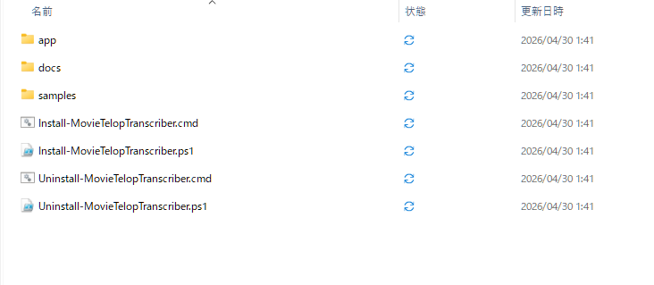
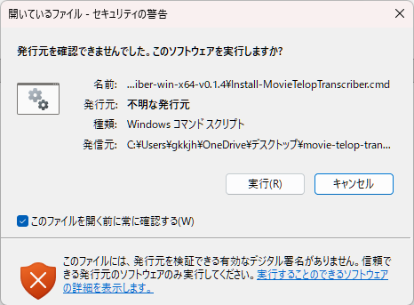
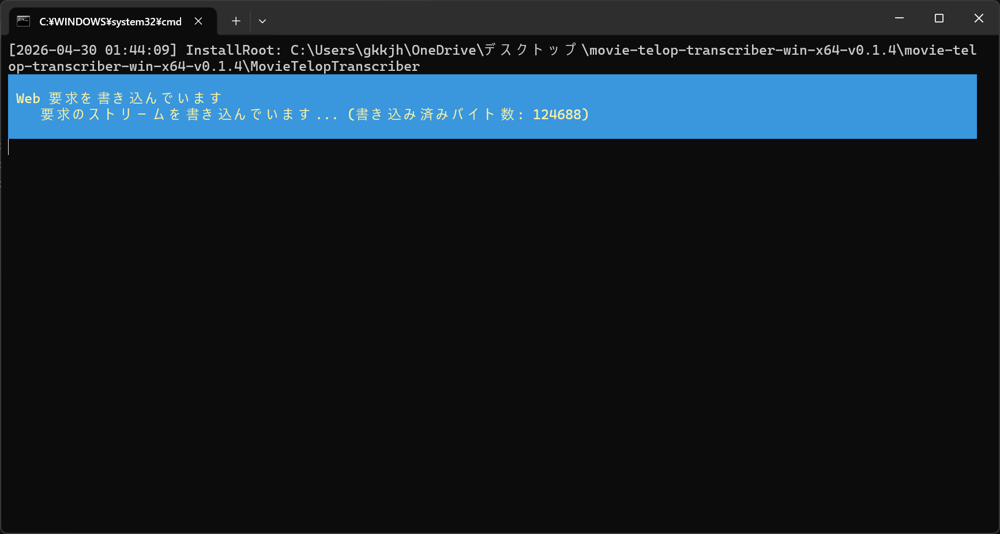
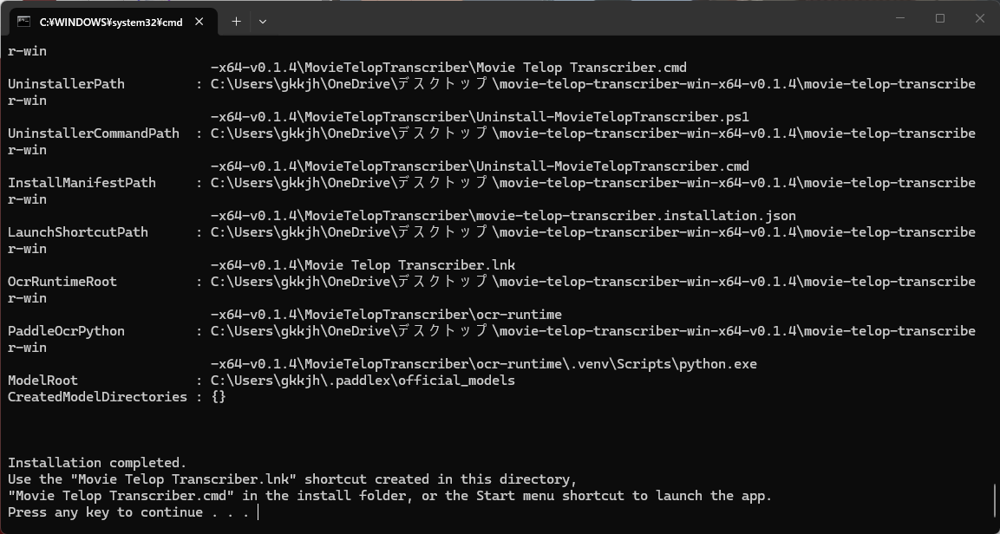
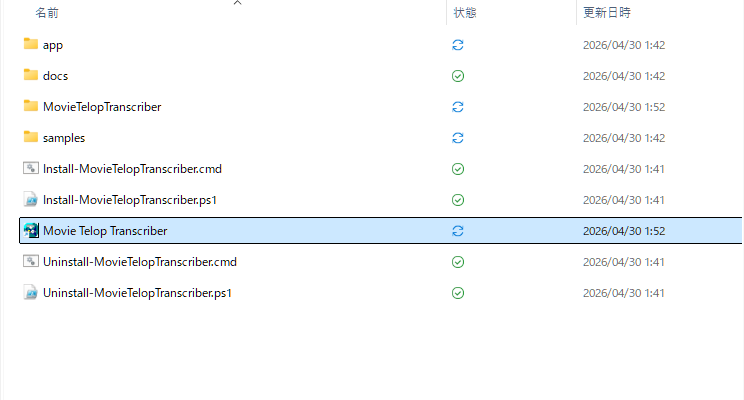
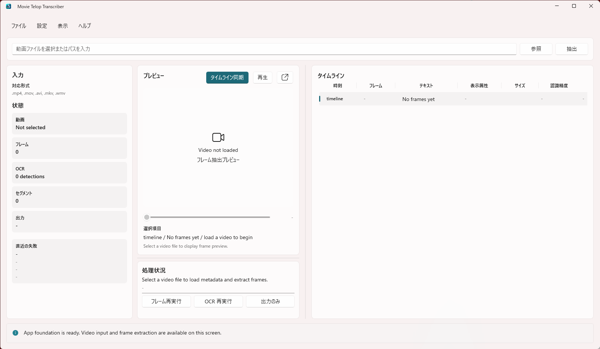
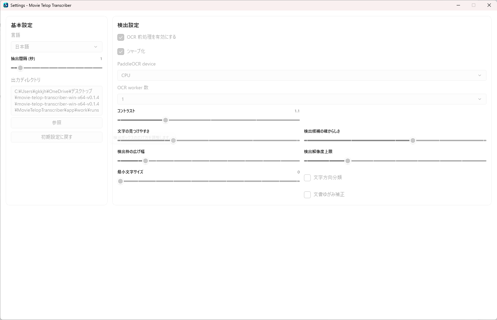
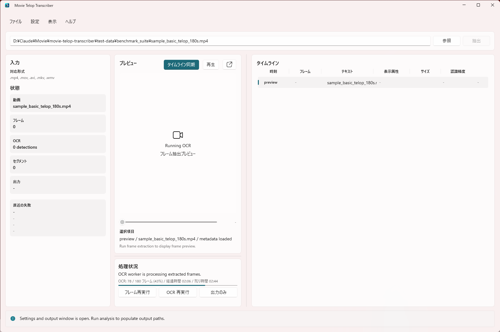
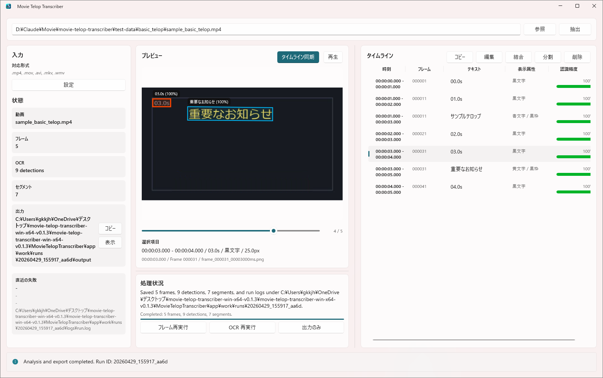

# 導入手順書

## この文書の位置づけ
- 対象読者:
  利用者、導入担当者、配布物検証担当者
- 読む目的:
  Windows 環境へ導入し、実動画 OCR を実行できる状態まで持っていく
- 関連文書:
  [00_文書ガイド.md](00_文書ガイド.md)、[16_利用ガイド.md](16_利用ガイド.md)、[11_配布構成と同梱物.md](11_配布構成と同梱物.md)、[18_配布物manifest.md](18_配布物manifest.md)

## 1. 文書情報
- 対象 Issue: `#49`、`#114`、`#122`
- 作成日: 2026-04-29
- 対象工程: リリース
- 記録者: Codex

## 2. 対象
`movie-telop-transcriber` を Windows x64 環境へ導入し、実動画 OCR を実行できる状態にする手順を示す。

推奨手順は、インストールしたい親ディレクトリで配布物に含まれる `Install-MovieTelopTranscriber.cmd` から開始するオンライン導入である。内部のインストーラは、実行したディレクトリ配下に `MovieTelopTranscriber` フォルダを作成し、PaddleOCR 用 Python 仮想環境、PaddlePaddle / PaddleOCR package、OCR モデル取得、起動設定ファイル作成、スタートメニュー登録をまとめて行う。

手動導入とオフライン導入は、ネットワーク制限や管理された端末でインストーラを使えない場合のフォールバックとして扱う。

2026-04-30 の再評価では、`Release build zip + installer` を標準導入構成として維持し、`self-contained publish` は再検証でも起動失敗したため採用しない判断に更新した。詳細は [test-results/2026-04-30_配布方式と導入構成の再評価.md](test-results/2026-04-30_配布方式と導入構成の再評価.md) を参照する。

## 2.1 導入構成の比較

| 構成 | 想定利用者 | 利点 | 欠点 | 判断 |
| --- | --- | --- | --- | --- |
| オンライン installer 標準導入 | 一般利用者 | app / runtime / settings を一括で揃えられる | ネットワーク接続と Python 3.10 が必要 | 標準採用 |
| 手動導入 / オフライン導入 | 管理端末、閉域端末 | 接続制限下でも使える | 手順が長く、設定ミス余地が大きい | フォールバック |
| 事前構築済み runtime pack | 管理者、再配布担当 | runtime を横展開しやすい | release asset と検証手順が追加で必要 | 将来候補 |

## 3. 配布物
GitHub Release から次の配布物を取得する。

| 配布物 | 必須 | 用途 |
| --- | --- | --- |
| `movie-telop-transcriber-win-x64-v<version>.zip` | 必須 | アプリ本体、WinUI / Windows App SDK 関連 DLL、OpenCVSharp 関連 DLL、PaddleOCR worker script、利用者向け文書、最小サンプルを含む |
| `Install-MovieTelopTranscriber.cmd` | 推奨 | ダブルクリックで PowerShell インストーラを開始する |
| `Install-MovieTelopTranscriber.ps1` | 代替 | アプリ本体 zip の取得、配置、PaddleOCR runtime 準備、モデル取得、起動設定ファイル作成を行う |
| `Uninstall-MovieTelopTranscriber.cmd` | 同梱 | 導入先からアンインストーラーを起動する |
| PaddleOCR ランタイムパック | 任意 | 現時点では標準 asset ではない。オフライン導入用に Python 環境、Python package、PaddleOCR モデルを別 zip として配布する場合に使う |

現行のアプリ本体 zip には Python runtime、PaddlePaddle / PaddleOCR の Python package、PaddleOCR モデル本体を同梱しない。オンライン導入ではインストーラがインターネット経由で取得する。

## 4. 導入前提
### 4.1 OS と CPU
- Windows x64 環境を対象とする。
- アプリの TargetPlatformMinVersion は `10.0.17763.0` である。
- 32 bit Windows は対象外とする。

### 4.2 .NET runtime
アプリ本体の `.runtimeconfig.json` は次の framework を参照する。

| framework | version |
| --- | --- |
| `Microsoft.NETCore.App` | `10.0.0` |
| `Microsoft.WindowsDesktop.App` | `10.0.0` |

対象端末には .NET 10 Desktop Runtime x64 を導入する。確認できる環境では、PowerShell で次を実行する。

```powershell
dotnet --list-runtimes
```

出力に `Microsoft.NETCore.App 10.0.x` と `Microsoft.WindowsDesktop.App 10.0.x` が含まれていれば、アプリ本体の .NET runtime 前提を満たす。

### 4.3 PaddleOCR 用 Python
実動画 OCR には PaddleOCR を導入した Python が必要である。標準導入で検証する組み合わせは次のとおり。

| 項目 | 値 |
| --- | --- |
| Python | `3.10.x` |
| PaddlePaddle | `3.2.0` CPU |
| PaddleOCR | `3.5.0` |
| OCR モデル | `PP-OCRv5_server_det`、`PP-OCRv5_server_rec` |
| 推論デバイス | `cpu` |

GPU 利用、別 Python version、別 PaddleOCR version は標準導入手順の対象外とする。

## 5. インストーラによる導入
### 5.1 標準導入
配布物に含まれる `Install-MovieTelopTranscriber.cmd` をダブルクリックする。PowerShell から直接実行したい場合は `Install-MovieTelopTranscriber.ps1` を使う。

配布 zip を展開した直後の構成:



配布 zip を展開した直下にも `app` フォルダは含まれるが、こちらは導入用同梱物である。字幕検出に使う起動先は、導入後に作成される `MovieTelopTranscriber\app\MovieTelopTranscriber.App.exe` またはスタートメニューの `Movie Telop Transcriber` とする。

`Install-MovieTelopTranscriber.cmd` の初回実行時に Windows の実行確認が表示された場合は、発行元を確認したうえで `実行` を選ぶ。



```powershell
powershell -NoProfile -ExecutionPolicy Bypass `
  -File .\tools\install\Install-MovieTelopTranscriber.ps1
```

既定の配置先:

| 種別 | 既定パス |
| --- | --- |
| アプリ本体 | `<実行ディレクトリ>\MovieTelopTranscriber` |
| OCR runtime | `<実行ディレクトリ>\MovieTelopTranscriber\ocr-runtime` |
| 起動設定ファイル | `<実行ディレクトリ>\MovieTelopTranscriber\app\movie-telop-transcriber.settings.json` |
| 起動スクリプト | `<実行ディレクトリ>\MovieTelopTranscriber\Start-MovieTelopTranscriber.ps1` |
| OCR モデル | `%USERPROFILE%\.paddlex\official_models` |

インストーラは次を実行する。

1. GitHub Release から `movie-telop-transcriber-win-x64-v<version>.zip` を取得する。
2. アプリ本体を `InstallRoot` へ展開する。
3. Python 3.10 の仮想環境を作成する。
4. `paddlepaddle==3.2.0` と `paddleocr==3.5.0` を導入する。
5. `paddle_ocr_worker.py --warmup-models --warmup-language ja` を実行し、PaddleOCR モデルを取得する。
6. `app\movie-telop-transcriber.settings.json` を作成し、PaddleOCR 用 Python、worker script、OCR 設定を書き込む。
7. 互換用の起動スクリプトを作成する。
8. スタートメニューに `MovieTelopTranscriber.App.exe` 直起動のショートカットを作成する。
9. インストーラを実行したディレクトリに、導入後アプリを指す `Movie Telop Transcriber.lnk` を作成する。

インストール中は、配布物取得や OCR runtime 準備の進行状況がコンソールに表示される。



正常完了時は、作成されたパスと起動方法がコンソールに表示される。



インストーラ実行ディレクトリには、導入先を指す `Movie Telop Transcriber` ショートカットが作成される。



### 5.2 配置先を指定する

```powershell
powershell -NoProfile -ExecutionPolicy Bypass `
  -File .\tools\install\Install-MovieTelopTranscriber.ps1 `
  -InstallRoot D:\Tools\movie-telop-transcriber `
  -OcrRuntimeRoot D:\Tools\movie-telop-ocr-runtime
```

### 5.3 再インストール
既存のアプリ配置を置き換える場合は `-Force` を付ける。

```powershell
powershell -NoProfile -ExecutionPolicy Bypass `
  -File .\tools\install\Install-MovieTelopTranscriber.ps1 `
  -Force
```

`-Force` は `InstallRoot` 配下の `app`、`docs`、`samples` を置き換える。OCR runtime は再利用され、必要な package 更新とモデル取得が実行される。

### 5.4 ローカル zip から導入する
事前に取得した zip またはローカルで作成した zip を使う場合:

```powershell
powershell -NoProfile -ExecutionPolicy Bypass `
  -File .\tools\install\Install-MovieTelopTranscriber.ps1 `
  -PackageZipPath .\movie-telop-transcriber-win-x64-v<version>.zip
```

### 5.5 OCR runtime とモデル取得を省略する
アプリ本体だけを配置する場合:

```powershell
powershell -NoProfile -ExecutionPolicy Bypass `
  -File .\tools\install\Install-MovieTelopTranscriber.ps1 `
  -SkipOcrSetup `
  -SkipModelDownload
```

この場合、実動画 OCR を使うには、`app\movie-telop-transcriber.settings.json` の `paddleOcr.pythonPath` を利用可能な Python へ合わせる。

### 5.6 事前確認
実際の配置を行わず、インストール計画だけを確認する場合:

```powershell
powershell -NoProfile -ExecutionPolicy Bypass `
  -File .\tools\install\Install-MovieTelopTranscriber.ps1 `
  -WhatIf
```

## 6. 起動
インストーラを使った場合は、スタートメニューの `Movie Telop Transcriber`、`MovieTelopTranscriber\app\MovieTelopTranscriber.App.exe`、またはインストーラ実行ディレクトリに作成された `Movie Telop Transcriber.lnk` を使って起動する。

互換用に `Start-MovieTelopTranscriber.ps1` も生成されるが、通常利用では不要である。

PowerShell から起動する場合:

```powershell
powershell -NoProfile -ExecutionPolicy Bypass `
  -File "$env:LOCALAPPDATA\Programs\MovieTelopTranscriber\Start-MovieTelopTranscriber.ps1"
```

通常起動では、アプリは `app\movie-telop-transcriber.settings.json` を読み込んで次の設定を解決する。

```json
{
  "ocrEngine": "paddleocr",
  "paddleOcr": {
    "pythonPath": "<OcrRuntimeRoot>\\.venv\\Scripts\\python.exe",
    "scriptPath": "<InstallRoot>\\app\\tools\\ocr\\paddle_ocr_worker.py",
    "device": "cpu",
    "language": "ja",
    "minScore": 0.5,
    "normalizeSmallKana": true,
    "preprocess": true,
    "contrast": 1.1,
    "sharpen": true,
    "workerCount": 1
  }
}
```

PowerShell 起動スクリプトを使う場合も、実際の OCR 解決元はこの設定ファイルである。

## 6.1 画面イメージ
起動直後の画面:



設定画面:



OCR 実行中の画面:



字幕検出後の画面:



## 6.2 アンインストール
導入先の `MovieTelopTranscriber` フォルダにある `Uninstall-MovieTelopTranscriber.cmd` を実行する。

アンインストーラーは次を削除する。

1. `MovieTelopTranscriber` 配下のアプリ本体、文書、サンプル、OCR runtime、起動設定、ランチャー、アンインストーラー自身
2. スタートメニューの `Movie Telop Transcriber` ショートカット
3. インストーラを実行したディレクトリに作成した `Movie Telop Transcriber.lnk`
4. この導入先を指している `MOVIE_TELOP_PADDLEOCR_PYTHON`、`MOVIE_TELOP_PADDLEOCR_SCRIPT`、`MOVIE_TELOP_OCR_WORKER` のユーザー環境変数
5. この導入で新規取得した PaddleOCR モデルディレクトリ

共有モデルキャッシュもまとめて削除したい場合は、PowerShell から次を実行する。

```powershell
powershell -NoProfile -ExecutionPolicy Bypass `
  -File .\MovieTelopTranscriber\Uninstall-MovieTelopTranscriber.ps1 `
  -RemoveSharedModelCache
```

## 7. 初回確認
1. アプリを起動する。
2. 入力動画として `samples/basic_telop/sample_basic_telop.mp4`、または利用者が確認可能な短い動画を選択する。
3. 出力先フォルダを、書き込み可能な任意フォルダに設定する。
4. `抽出` を実行する。
5. 処理完了後、出力フォルダ配下の run ディレクトリを確認する。

生成される主な成果物:

```text
work/runs/<run_id>/
  frames/
  ocr/
  attributes/
  output/
    segments.json
    segments.csv
    frames.csv
    segments.srt
    segments.vtt
    segments.ass
  logs/
    run.log
    summary.json
```

`logs/summary.json` または `logs/run.log` で `ocr_engine` が `paddleocr` になっていることを確認する。`json-sidecar` になっている場合、その結果は実動画 OCR の確認結果として扱わない。

導入直後に OCR runtime の成立を再確認したい場合は、次を実行する。

```powershell
powershell -NoProfile -ExecutionPolicy Bypass `
  -File .\MovieTelopTranscriber\Test-MovieTelopTranscriberOcrReadiness.ps1 `
  -InstallRoot .\MovieTelopTranscriber `
  -AsJson
```

期待値:
- `status` が `ready`
- `pythonVersion`、`paddleVersion`、`paddleOcrVersion` が埋まる
- `checks` の `python_imports` と `paddle_models` が `ready`

`warning` または `error` の場合は、同じ JSON 内の `checks` を見て、`python_path`、`python_imports`、`paddle_models` のどこで不足したかを切り分ける。

## 8. 手動導入
インストーラを使わない場合は、以下を手動で行う。

### 8.1 アプリ本体の配置
1. 任意の導入先フォルダを作成する。

```powershell
New-Item -ItemType Directory -Force D:\Tools\movie-telop-transcriber
```

2. `movie-telop-transcriber-win-x64-v<version>.zip` を展開する。

```powershell
Expand-Archive `
  -Path .\movie-telop-transcriber-win-x64-v<version>.zip `
  -DestinationPath D:\Tools\movie-telop-transcriber `
  -Force
```

3. 展開後の構成を確認する。

```powershell
$releaseRoot = "D:\Tools\movie-telop-transcriber\movie-telop-transcriber-win-x64-v<version>"
Test-Path "$releaseRoot\app\MovieTelopTranscriber.App.exe"
Test-Path "$releaseRoot\app\tools\ocr\paddle_ocr_worker.py"
Test-Path "$releaseRoot\docs\12_導入手順書.md"
```

すべて `True` であれば、アプリ本体の配置は完了している。

### 8.2 PaddleOCR 環境の準備

```powershell
New-Item -ItemType Directory -Force D:\Tools\movie-telop-ocr-runtime
py -3.10 -m venv D:\Tools\movie-telop-ocr-runtime\.venv

D:\Tools\movie-telop-ocr-runtime\.venv\Scripts\python.exe -m pip install --upgrade pip
D:\Tools\movie-telop-ocr-runtime\.venv\Scripts\python.exe -m pip install paddlepaddle==3.2.0 -i https://www.paddlepaddle.org.cn/packages/stable/cpu/
D:\Tools\movie-telop-ocr-runtime\.venv\Scripts\python.exe -m pip install paddleocr==3.5.0
```

モデルを取得する。

```powershell
D:\Tools\movie-telop-ocr-runtime\.venv\Scripts\python.exe `
  "$releaseRoot\app\tools\ocr\paddle_ocr_worker.py" `
  --warmup-models `
  --warmup-language ja
```

モデル配置を確認する。

```powershell
Test-Path "$env:USERPROFILE\.paddlex\official_models\PP-OCRv5_server_det"
Test-Path "$env:USERPROFILE\.paddlex\official_models\PP-OCRv5_server_rec"
```

### 8.3 手動起動

```powershell
$releaseRoot = "D:\Tools\movie-telop-transcriber\movie-telop-transcriber-win-x64-v<version>"
$appDir = Join-Path $releaseRoot "app"

$env:MOVIE_TELOP_OCR_ENGINE = "paddleocr"
$env:MOVIE_TELOP_PADDLEOCR_PYTHON = "D:\Tools\movie-telop-ocr-runtime\.venv\Scripts\python.exe"
$env:MOVIE_TELOP_PADDLEOCR_DEVICE = "cpu"
$env:MOVIE_TELOP_PADDLEOCR_MIN_SCORE = "0.5"
$env:MOVIE_TELOP_PADDLEOCR_PREPROCESS = "true"
$env:MOVIE_TELOP_PADDLEOCR_CONTRAST = "1.1"
$env:MOVIE_TELOP_PADDLEOCR_SHARPEN = "true"

Start-Process `
  -FilePath (Join-Path $appDir "MovieTelopTranscriber.App.exe") `
  -WorkingDirectory $appDir
```

## 9. オフライン導入
ネットワーク接続できる端末でインストーラを実行し、次のフォルダを対象端末へコピーする。

| コピー元 | コピー先 |
| --- | --- |
| `%LOCALAPPDATA%\Programs\MovieTelopTranscriber` | 任意のアプリ導入先 |
| `%LOCALAPPDATA%\Programs\MovieTelopTranscriber\ocr-runtime` | 起動スクリプト内の `MOVIE_TELOP_PADDLEOCR_PYTHON` と一致する場所 |
| `%USERPROFILE%\.paddlex` | 対象端末の `%USERPROFILE%\.paddlex` |

コピー後、対象端末で `app\movie-telop-transcriber.settings.json` の `paddleOcr.pythonPath` がコピー先の Python を指していることを確認する。

## 10. サンプル sidecar 検証
`json-sidecar` は開発・検証用の明示モードであり、実動画 OCR の標準手順では使わない。

サンプル sidecar 検証を行う場合だけ、次のように指定する。

```powershell
$env:MOVIE_TELOP_OCR_ENGINE = "json-sidecar"
```

sidecar がない場合は `OCR_SIDECAR_NOT_FOUND` として OCR エラーになる。これは、実動画を 0 件成功として扱わないための挙動である。

## 11. よくある導入失敗
| 症状 | 確認すること | 対処 |
| --- | --- | --- |
| インストーラが PowerShell 実行ポリシーで止まる | 起動コマンドに `-ExecutionPolicy Bypass` があるか | 本書の導入コマンドをそのまま実行する |
| アプリが起動しない | .NET 10 Desktop Runtime x64 が導入されているか | `dotnet --list-runtimes` で `Microsoft.WindowsDesktop.App 10.0.x` を確認し、不足していれば導入する |
| 起動直後に終了し、終了コードが `0xC000027B` になる | self-contained publish 出力を直接使っていないか | GitHub Release のアプリ本体 zip またはインストーラを使う。`dotnet publish --self-contained true` の出力は配布候補にしない |
| self-contained 再検証で `0xE0434352` になる | `WindowsAppSdkDeploymentManagerInitialize=true` を付けた publish を試していないか | `.NET Runtime` のイベントログでは `System.InvalidOperationException: プロセスにパッケージ ID がありません。` を確認している。unpackaged self-contained の回避策としては採用せず、標準導入構成へ戻す |
| インストーラが `py -3.10` を見つけられない | Python Launcher と Python 3.10 が導入されているか | Python 3.10 を導入するか、`-PythonCommand` と `-PythonArguments` を指定する |
| OCR が `ModuleNotFoundError: No module named 'paddleocr'` で失敗する | `MOVIE_TELOP_PADDLEOCR_PYTHON` が PaddleOCR 導入済み Python を指しているか | インストーラを再実行する。手動導入の場合は `<python> -m pip show paddleocr` を確認する |
| OCR がモデル取得で失敗する | ネットワーク接続、プロキシ、`.paddlex` への書き込み権限 | ネットワーク接続できる端末で `--warmup-models` を実行し、対象端末へ `.paddlex` をコピーする |
| `ocr_engine=json-sidecar` になっている | `MOVIE_TELOP_OCR_ENGINE=json-sidecar` を設定したまま起動していないか | 実動画 OCR では `MOVIE_TELOP_OCR_ENGINE` を未指定、または `paddleocr` にする |
| 出力先フォルダの作成に失敗する | 出力先に書き込み権限があるか | 利用者が書き込み可能なフォルダを指定する。失敗時は `OUTPUT_ROOT_UNAVAILABLE` として表示される |
| 文字は検出されるが結果が崩れる | 前処理、検出しきい値、文字方向分類の設定 | 設定画面で検出設定を調整し、OCR を再実行する |

self-contained の再現手順は [test-results/2026-04-30_issue194_selfcontained_repro.md](test-results/2026-04-30_issue194_selfcontained_repro.md)、matrix 比較は [test-results/2026-04-30_issue195_selfcontained_matrix.md](test-results/2026-04-30_issue195_selfcontained_matrix.md)、`init=true` 時のイベントログ採取は [test-results/2026-04-30_issue196_selfcontained_init_enabled_diagnostic.md](test-results/2026-04-30_issue196_selfcontained_init_enabled_diagnostic.md) を参照する。

## 12. 既知制約
- CPU 推論では、動画や設定によって 1 フレームあたり数秒かかる場合がある。
- `font_size` は OCR 矩形高さ相当であり、実フォントサイズではない。
- `text_color`、`stroke_color`、`text_type` は暫定ラベルであり、厳密な色値や意味分類ではない。
- `font_family` と `background_color` は初期リリースでは `null` を許容する。
- SRT / VTT はテキストと時刻のみ、ASS は標準スタイルのみを使う。

## 13. 次の確認
導入できたら、出力フォルダ内の `segments.json`、`segments.csv`、`segments.srt`、`logs/summary.json` を確認する。出力仕様の詳細は `docs/spec/04_出力仕様.md`、属性範囲の詳細は `docs/spec/07_テロップ属性リリース範囲.md` を参照する。
